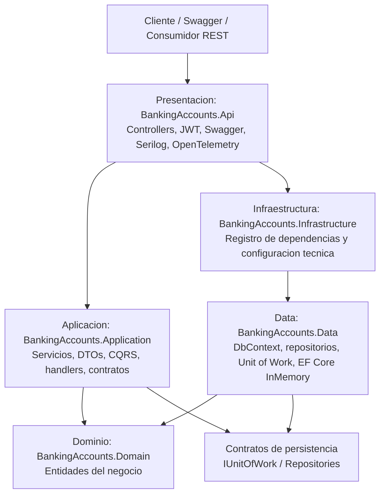

# Banking Accounts API

## Contexto

Banking Accounts API es una API REST creada con .NET 10 y C# para administrar cuentas bancarias. El proyecto implementa una arquitectura en capas, autenticacion JWT basica, documentacion Swagger, persistencia en memoria con Entity Framework Core y observabilidad con Serilog y OpenTelemetry.

La solucion esta pensada como una prueba de concepto clara y extensible para operaciones CRUD sobre cuentas bancarias, manteniendo separadas las responsabilidades de presentacion, aplicacion, infraestructura, datos y dominio.

## Tecnologias usadas

| Tecnologia | Uso |
| --- | --- |
| .NET 10 | Framework principal de la solucion |
| C# | Lenguaje de programacion |
| ASP.NET Core Web API | Capa de presentacion y exposicion REST |
| Entity Framework Core InMemory | Persistencia en memoria para la POC |
| Swagger / Swashbuckle | Documentacion interactiva de endpoints |
| JWT Bearer | Autenticacion basica por token |
| CQRS | Separacion de comandos y consultas |
| Unit of Work | Coordinacion de operaciones de persistencia |
| Repository Pattern | Abstraccion de acceso a datos |
| Serilog | Logging estructurado |
| OpenTelemetry | Trazas, metricas y logs de observabilidad |

## Endpoints

La API expone endpoints versionados para autenticacion y administracion de cuentas bancarias.

Base URL local sugerida:

```text
http://localhost:5088
```

Swagger:

```text
/swagger
```

Version actual:

```text
/api/v1
```

## Versionamiento del API

El API usa versionamiento por segmento de URL mediante `Asp.Versioning`, siguiendo la convencion comun de ASP.NET Core para contratos REST publicos.

Formato de rutas:

```text
/api/v{version}/{recurso}
```

La version vigente es `v1`. Los clientes deben consumir los endpoints usando el prefijo `/api/v1`, por ejemplo:

```text
/api/v1/accounts
```

Swagger publica la documentacion por version:

```text
/swagger/v1/swagger.json
```

La interfaz Swagger en ambiente `Development` lista automaticamente las versiones disponibles desde:

```text
/swagger
```

Credenciales locales para generar token JWT:

```text
usuario: admin
password: admin123
```

## Diagrama de capa del API

El siguiente diagrama muestra la separacion de responsabilidades entre capas.



Descripcion:

- **Presentacion** recibe las solicitudes HTTP, valida autenticacion JWT y publica la documentacion Swagger.
- **Aplicacion** contiene el caso de uso principal mediante un unico servicio de cuentas, CQRS, comandos, consultas, DTOs y handlers.
- **Infraestructura** registra servicios tecnicos y dependencias compartidas.
- **Data** implementa EF Core InMemory, repositorios y Unit of Work.
- **Dominio** contiene la entidad principal `BankAccount`.

## Tabla de endpoints

| Verbo | Nombre de endpoint | Parametros | Respuesta | Descripcion de la funcionalidad |
| --- | --- | --- | --- | --- |
| POST | `/api/v1/auth/token` | Body: `username`, `password` | `200 OK` con `accessToken` y `expiresAtUtc`; `401 Unauthorized` si las credenciales son invalidas | Genera un token JWT para consumir los endpoints protegidos. |
| GET | `/api/v1/accounts` | Header: `Authorization: Bearer {token}` | `200 OK` con lista de cuentas; `401 Unauthorized` | Obtiene todas las cuentas bancarias registradas. |
| GET | `/api/v1/accounts/{id}` | Route: `id` tipo `Guid`; Header JWT | `200 OK` con cuenta; `404 Not Found`; `401 Unauthorized` | Obtiene una cuenta bancaria especifica por identificador. |
| POST | `/api/v1/accounts` | Header JWT; Body: `accountNumber`, `holderName`, `balance`, `currency` | `201 Created` con cuenta creada; `400 Bad Request`; `409 Conflict`; `401 Unauthorized` | Crea una nueva cuenta bancaria validando que el numero de cuenta no exista. |
| PUT | `/api/v1/accounts/{id}` | Route: `id` tipo `Guid`; Header JWT; Body: `accountNumber`, `holderName`, `balance`, `currency`, `isActive` | `200 OK` con cuenta actualizada; `400 Bad Request`; `404 Not Found`; `409 Conflict`; `401 Unauthorized` | Actualiza los datos de una cuenta bancaria existente. |
| DELETE | `/api/v1/accounts/{id}` | Route: `id` tipo `Guid`; Header JWT | `204 No Content`; `404 Not Found`; `401 Unauthorized` | Elimina una cuenta bancaria existente por identificador. |

## Ejecucion local

Restaurar y compilar:

```powershell
dotnet build BankingAccounts.slnx
```

Ejecutar la API:

```powershell
dotnet run --project BankingAccounts.Api\BankingAccounts.Api.csproj
```

Abrir Swagger:

```text
https://localhost:{puerto}/swagger
```

Tambien puede usarse la URL HTTP configurada al iniciar el proyecto desde consola.

## Uso con Docker

La solucion incluye un `Dockerfile` multi-stage optimizado con imagen final basada en Alpine. El contenedor expone internamente el puerto `8080`.

Construir la imagen:

```powershell
docker build -t banking-accounts-api:local .
```

Ejecutar el contenedor:

```powershell
docker run -d --name banking-accounts-api -p 8090:8080 banking-accounts-api:local
```

URL base usando Docker:

```text
http://localhost:8090
```

Generar un token JWT:

```powershell
Invoke-RestMethod `
  -Method Post `
  -Uri "http://localhost:8090/api/v1/auth/token" `
  -ContentType "application/json" `
  -Body '{"username":"admin","password":"admin123"}'
```

Consumir un endpoint protegido:

```powershell
$tokenResponse = Invoke-RestMethod `
  -Method Post `
  -Uri "http://localhost:8090/api/v1/auth/token" `
  -ContentType "application/json" `
  -Body '{"username":"admin","password":"admin123"}'

$headers = @{ Authorization = "Bearer $($tokenResponse.accessToken)" }

Invoke-RestMethod `
  -Method Get `
  -Uri "http://localhost:8090/api/v1/accounts" `
  -Headers $headers
```

Habilitar Swagger dentro del contenedor:

Por defecto, Swagger solo se habilita en ambiente `Development`. Para verlo desde Docker, ejecutar el contenedor configurando `ASPNETCORE_ENVIRONMENT`:

```powershell
docker run -d --name banking-accounts-api-dev `
  -p 8090:8080 `
  -e ASPNETCORE_ENVIRONMENT=Development `
  banking-accounts-api:local
```

Luego abrir:

```text
http://localhost:8090/swagger
```

Ver logs del contenedor:

```powershell
docker logs banking-accounts-api
```

Detener y eliminar el contenedor:

```powershell
docker stop banking-accounts-api
docker rm banking-accounts-api
```
